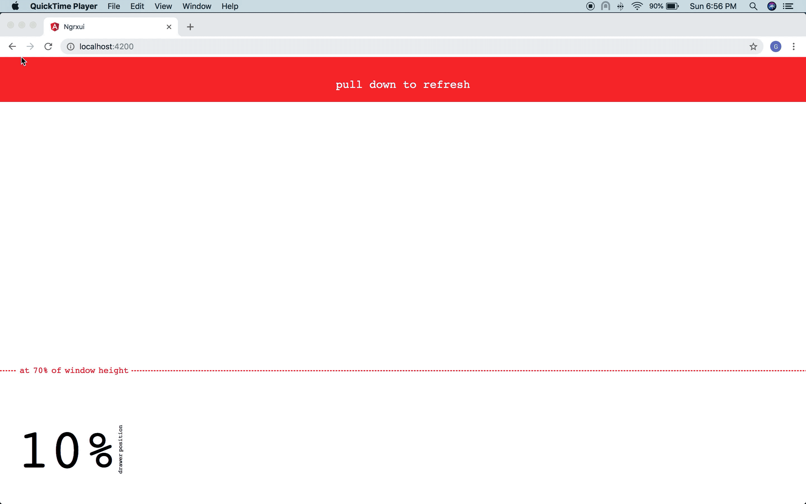

# Going Reactive with RxJS

This repository contains slides and demo code for my JakartaJs talk, 26 September 2018.

## Slides

You can get in [here](./slides.pdf)

## Demo

here are examples that demonstrate RxJs can work with and without UI frameworks/libraries.

### Counter medium-claps-like with plain RxJS

[code](./rxjs-counter-claps).

### Pull down to refresh simulation with Angular

[code](./angular-demo)

### Ajax Cancelation with Vue

[code](./vue-package-viz)

### Handle react animation state

[code](https://github.com/ghapsara/analyzing-jokowi-word-usage)

